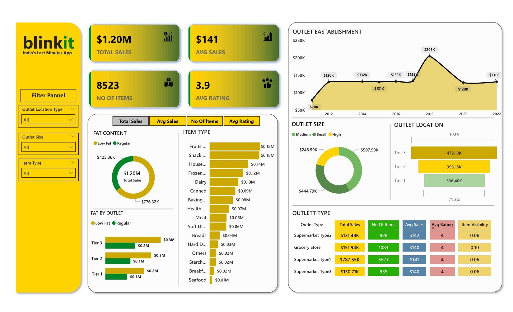
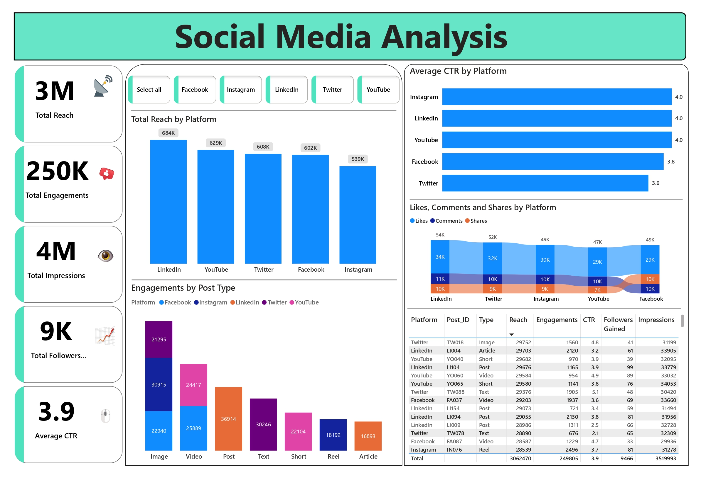

<!-- ================= HEADER BANNER ================= -->

<h1 align="center">👋 Hi, I'm Kuldeep Singh</h1>

<h3 align="center">
🚀 Data Analyst → Data Engineer | SQL • ETL • Data Warehousing • BI
</h3>

📍 India | 📊 Turning Raw Data into Scalable Data Systems  
💡 Passionate about Data Pipelines, Analytics, and Business Intelligence

---

# 👨‍💼 Professional Summary

✔ Data-focused engineer with strong foundation in **SQL, ETL pipelines, and data modeling**  
✔ Experience building **data warehouses and interactive dashboards**  
✔ Skilled in cleaning, transforming, and analyzing large datasets  
✔ Strong understanding of **data engineering workflows and analytics systems**  
✔ Passionate about building scalable data solutions for business insights  

🎯 **Career Goal:** Data Analyst / Analytics Engineer

---

# 🏆 Career Highlights (Recruiter Focused)

✅ Built ETL pipelines for automated data workflows  
✅ Developed data warehouse architecture for analytics queries  
✅ Created business dashboards used for decision-making insights  
✅ Performed advanced SQL joins, aggregations, and data transformations  
✅ Delivered interactive visual analytics using Power BI  

---

# 🛠️ Technical Skills

## 👨‍💻 Programming & Query Languages

---

## 🌐 Web Technologies

---

## 🗄️ Databases & Data Systems

---

## 📊 Data Analysis & Visualization

---

## ⚙️ Data Engineering Concepts

---

## 🧰 Tools & Platforms

---

# 💼 Experience

## Data Engineer Intern — Altimetrik India Pvt. Ltd.

- Developed data warehouse infrastructure for business analytics
- Implemented ETL processes to automate data pipelines
- Improved data accessibility for complex queries
- Enabled real-time data availability for reporting

---

# 📂 Key Projects
---

### 🛒 Blinkit Grocery Analysis 
- Power BI interactive dashboard
- Multi-source data integration
- DAX calculations and security implementation  
🔗 https://github.com/kuldeep5507/Blinkit-Grocery

---

### 📱 Social Media Analysis May 2025
- Collects, Cleans, and Analyzes data
- Database schema design
- Query optimization     
- To generate actionable insights
- Supporting business decision     
🔗https://github.com/kuldeep5507/Social-Media-Analysis-May-2025-

---

### 📈 Captain Store Report Dashboard
- Excel analytics dashboard
- Pivot tables and revenue insights
- Inventory performance tracking  
🔗 https://github.com/kuldeep5507/Captain-Store-Report-2025

---

# 📊 GitHub Performance
>

---

# 🌱 Currently Learning

- Advanced SQL Optimization
- Data Engineering Architecture
- Cloud Data Platforms
- Big Data Technologies
- Node Js

---

# 📫 Connect With Me

📧 Email: Kulsingh2304@gmail.com  
🌐 Blog: https://studysphere008.blogspot.com/  
💻 GitHub: https://github.com/kuldeep5507  

---

⭐ Building Scalable Data Systems | Open to Data Analyst Opportunities

